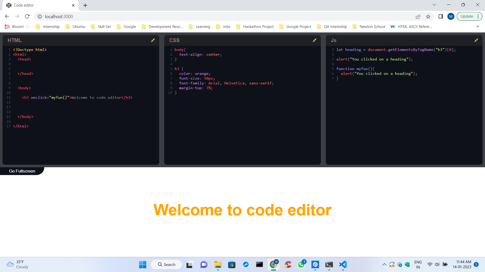

# Online-Code-Editor-using-React-Codemirror #

# Features

- Toggleable fullscreen mode
- Auto render code (within 250ms)
- Auto-close tags (For HTML and XML)
- Auto-close brackets (For JavaScript and CSS)
- Highlight unclosed brackets (For JavaScript)
- Highlight active brackets (Brackets near cursor)
- Linting
- Expand-collapse code editors
- Material theme
- Mobile responsive

# Npm Packages Used
- Fort Awesome(for icons)
- fullscreen-react

